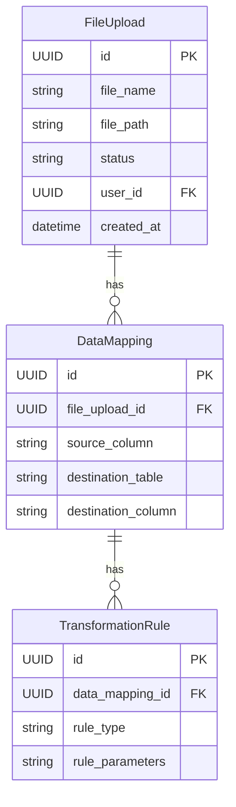

# Data Model: CSV Data Upload and Mapping

This document defines the data models for the CSV data upload and mapping feature.

## Entity Relationship Diagram (ERD)

## Entities

### 1. FileUpload

Tracks uploaded files and their import status.

- **`id`** (UUID, Primary Key): Unique identifier for the file upload.
- **`file_name`** (String): Original name of the uploaded file.
- **`file_path`** (String): Path to the uploaded file on the server.
- **`status`** (String): Current status of the import process (e.g., `uploaded`, `processing`, `completed`, `failed`).
- **`user_id`** (UUID, Foreign Key): The user who uploaded the file.
- **`created_at`** (DateTime): Timestamp of when the file was uploaded.

### 2. DataMapping

Stores the mapping configuration for each column in an uploaded file.

- **`id`** (UUID, Primary Key): Unique identifier for the data mapping.
- **`file_upload_id`** (UUID, Foreign Key): The file upload this mapping belongs to.
- **`source_column`** (String): The name of the column in the uploaded CSV/Excel file.
- **`destination_table`** (String): The name of the target database table.
- **`destination_column`** (String): The name of the target column in the database table.

### 3. TransformationRule

Defines rules for data conversion during the import process.

- **`id`** (UUID, Primary Key): Unique identifier for the transformation rule.
- **`data_mapping_id`** (UUID, Foreign Key): The data mapping this rule belongs to.
- **`rule_type`** (String): The type of transformation to apply (e.g., `lookup`, `format_date`, `to_uppercase`).
- **`rule_parameters`** (String): Parameters for the transformation rule (e.g., for a `lookup` rule, this could be the table and column to look up against).
